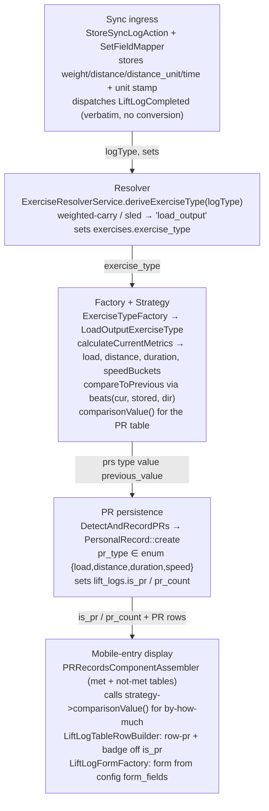
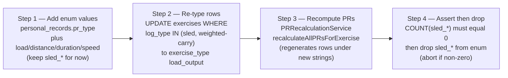

# Sled + Weighted-Carry → `load_output` Type — Plan (Logger side)

> **Reference architecture, NOT execution steps.** Execute from `docs/plans/sled-carry-load-output-prompt.md`
> (authored from `docs/plans/template-prompt.md`). Format per `docs/antigravity-steering.md` §9.
>
> **Cross-repo:** This is the Logger slice of a change owned by the root plan
> `../../docs/plans/sled-carry-unification-cross-repo.md` (Step 4). That root plan's **FROZEN (rev 7)**
> section is the source of truth for all shared names + semantics. Do NOT re-decide them here. Land in
> lockstep with the cross-app contract tests — never ahead of them.

---

## Before You Start (read in order)

```
docs/antigravity-steering.md                     → executor contract: git (NEVER commit), Pint ban, DB rules, milestones, AGY_COMPLETE, §13 consumer trace, §15 decomposition
.kiro/steering/project-conventions.md            → forward-only migrations, no column repurposing, domain folders, dispatch events
.kiro/steering/sync-api-context.md               → exercise-type strategy pattern, PR dispatch, data model
.kiro/steering/laravel-boost.md                  → Eloquent not DB::, constructor promotion, explicit return types, PHPUnit-only
```
Cross-repo source of truth (read, do not edit): `../../docs/plans/sled-carry-unification-cross-repo.md`
(FROZEN rev 7 + Step 4).

---

## What You're Building

One load-aware exercise type — `load_output` — that replaces both the bespoke `SledExerciseType` and the
routing of `weighted-carry` into `static_hold`. Sled and carry are the same shape: a **load** plus
**output axes** (distance and/or duration), any combination of which may appear on one set. PRs are
comparisons on independent axes, each with a **direction** (bigger- or smaller-is-better). Logger must
compute identical PRs to the Athlete engine (they round-trip through sync).

**PR records (FROZEN rev 7 §2) — these are the `pr_type` enum strings, verbatim, no aliases:**
- `load` — heaviest single-set weight. Direction **max**. Load normalized via `UnitResolver` (closes D1).
- `distance` — farthest single-set distance, integer-normalized meters. Direction **max**.
- `duration` — longest single-set duration, integer seconds. Direction **max**.
- `speed` — **minimum duration at a matched (load, distance)**. Direction **min**, keyed on the
  composite (load, distance). Semantics: among sets with the SAME load AND SAME distance (exact load +
  integer-normalized distance), a strictly shorter duration is a `speed` PR.

**Dropped:** the superseded `load_volume` / `sled_*` strings — do NOT introduce them.

**Labels (FROZEN §4; Logger's own copy, in the strategy match arms):** `load` → "Heaviest Load",
`distance` → "Farthest Distance", `duration` → "Longest Duration", `speed` → "Fastest Pace".

**End state:**
- New `LoadOutputExerciseType` + `load_output` config key; `SledExerciseType` + `sled` config key removed.
- `weighted-carry` AND `sled` resolve to `load_output`; `dual-kettlebell` + `static-hold` stay `static_hold`.
- Duration cap **900s** for `load_output` (FROZEN §7); `static_hold`'s 300s unchanged.
- `personal_records.pr_type` enum gains `load`/`distance`/`duration`/`speed`; historical sled + carry
  re-typed (scoped by `log_type`); affected PRs recomputed; then `sled_*` enum values dropped.
- **Logging form** offers weight + distance + distance_unit + time for `load_output` (config-driven via
  `form_fields` → `getFormFieldDefinitions`; today sled's form is weight+distance only and carry rides
  static_hold's time+weight — so this is a real form change, done via config).
- **Mobile-entry per-log PR table** (`PRRecordsComponentAssembler`) renders the four records in both the
  "met" (beaten) and "current / not-yet-beaten + by-how-much" tables — including `speed`'s composite-key
  de-dupe. **The by-how-much comparison logic MUST live in the strategy** (see the stipulation below), not
  in the assembler's `getComparisonValue` switch.

> **Zero behavioral change** to `static_hold` (genuine holds + dual-kettlebell), and to every non-sled/
> non-carry type. Only sled + weighted-carry change.

### Two consumers the strategy must serve (do not miss these)

1. **Logging form — config-driven, but it IS a change.** `LiftLogFormFactory` calls
   `strategy->getFormFieldDefinitions()` / config `form_fields`. Set `load_output`'s `form_fields` to
   `['weight','distance','distance_unit','time']` (+ field labels/increments/defaults mirroring sled for
   weight/distance and static_hold for time; distance step 5, weight step per unit). No form-layer code
   branch is added — the form renders from config.

2. **Mobile-entry PR met/not-met table — `app/Services/LiftLogTableRowBuilder/PRRecordsComponentAssembler.php`.**
   Per log it builds a **beaten/met** table (via `strategy->formatPRDisplay`) and a **current/not-yet-beaten**
   table with a **by-how-much comparison** (via `strategy->formatCurrentPRDisplay` + a `getComparisonValue()`
   `switch ($pr->pr_type)`). Today this switch has arms for `one_rm`/`volume`/`rep_specific`/`time`/
   `endurance`/… and **NO sled arms at all** — so sled's "current record + by-how-much" currently returns
   `null` (a pre-existing gap). It also has a per-type **beaten-PR-map** (`rep_specific_{reps}`,
   `hypertrophy_{weight}`, `density_{weight}_{reps}`, `consistency_{reps}`, else `{type}`) that de-dupes
   met-vs-current; `speed` is keyed by its composite bucket and needs a matching key here.

   **STIPULATED (not optional): move the per-type comparison OUT of `getComparisonValue`'s switch and INTO
   the strategy.** Each exercise type owns how it compares current metrics to a stored PR (e.g. a strategy
   method `comparisonValue(PersonalRecord $pr, array $currentMetrics, LiftLog $log): ?string`).
   `getComparisonValue` becomes a thin delegator (`return $strategy->comparisonValue(...)`), shrinking or
   eliminating its switch. This is a simplification of an existing branch-heavy function AND it fixes the
   missing sled/`load_output` comparison in one move — the decoupling your architecture wants. For the
   beaten-PR-map de-dupe, add `speed`'s composite-key case (`speed_{loadComp}_{integerMeters}`) alongside
   the existing keyed cases.

### PR-row styling is string-agnostic — verify, don't special-case

The mobile-entry lift row styling ("this log hit a PR") is driven by the generic `lift_logs.is_pr` /
`pr_count` flags, NOT the PR-type strings: `PRRecalculationService` + `DetectAndRecordPRs` set
`is_pr = count($prs) > 0`; `LiftLogTableRowBuilder` sets `cssClass => is_pr ? 'row-pr' : null` and calls
`addPRBadge()` on `is_pr`; `PRRecordsComponentAssembler` gates the beaten table on `is_pr`. So the row
styling + PR badge keep working automatically once `LoadOutputExerciseType` emits any PR. **Verification
step (not new code):** a feature test asserts a `load_output` log that sets a PR has `is_pr = true`,
`pr_count > 0`, and therefore the `row-pr` class + badge — proving the styling path is unaffected by the
new strings.

---

## Diagram L1 — Runtime PR pipeline (what each layer passes)



## Diagram L2 — Migration sequence (strict order; one-time)



---

## Existing Code to Understand (read before modifying)

```
config/exercise_types.php                                  → `types` map. `sled` entry (~261–304) is the shape to mirror; static_hold (~314–355) shows the 300s cap; factory config ~376. Add a `load_output` key; REMOVE the `sled` key at the end.
app/Services/ExerciseTypes/ExerciseTypeFactory.php         → determineExerciseType() ~165–174 reads exercise.exercise_type verbatim → config lookup. NO factory edit needed; a new config key resolves automatically.
app/Services/ExerciseTypes/SledExerciseType.php            → the reference to GENERALIZE then DELETE. calculateCurrentMetrics ~323–347 (maxWeight/maxDistance/totalVolume); compareToPrevious ~356–428 (strict > per axis, sled_* strings); static normalizeDistanceToMeters ~310 (ft→m); formatPRDisplay/formatCurrentPRDisplay ~434/~461. NOTE: it compares raw int weight (D1) and inlines 0.3048 (D4) — do NOT copy those.
app/Services/ExerciseTypes/StaticHoldExerciseType.php      → duration handling reference (time in seconds). Its 300s cap is config, not here. Leave it owning genuine holds + dual-kettlebell.
app/Services/ExerciseTypes/BaseExerciseType.php            → base class to extend.
app/Sync/Services/ExerciseResolverService.php              → deriveExerciseType() match: line ~131 'weighted-carry','dual-kettlebell','static-hold' => 'static_hold'; line ~135 'sled' => 'sled'. CHANGE: move 'weighted-carry' and 'sled' to a new arm → 'load_output'; keep 'dual-kettlebell'+'static-hold' on static_hold. Runs on AUTO-CREATE only → existing rows need the data migration.
app/Services/UnitResolver.php                              → convert()/format() (LBS_TO_KG/KG_TO_LBS ~9–10). Route load normalization through this (D1).
app/Listeners/DetectAndRecordPRs.php                       → writes PersonalRecord rows (~18–68); pr_type MUST be a valid enum value or insert throws → enum migration first.
app/Services/PRDetectionService.php                        → detectPRsWithDetails(): gates on getSupportedPRTypes() non-empty (~155); calls calculateCurrentMetrics + compareToPrevious; enriches previous_pr_id by matching pr_type string.
app/Services/PRRecalculationService.php                    → recalculateAllPRsForExercise(userId, exerciseId) — THE centralized recompute used by the re-typing migration.
app/Enums/PRType.php                                       → int bitmask; decoupled from string pr_type values. No new case needed. getSupportedPRTypes() is only a non-empty gate.
app/Services/Factories/LiftLogFormFactory.php              → builds the logging form from strategy->getFormFieldDefinitions()/config form_fields. NO branch to add — load_output's form_fields config drives it.
app/Services/LiftLogTableRowBuilder/PRRecordsComponentAssembler.php → the mobile-entry PR met/not-met table. Has getComparisonValue() switch(pr_type) (~215) + beaten-PR-map de-dupe (~144); STIPULATED to delegate comparison into the strategy. NO sled arms today (pre-existing gap load_output fixes).
app/Services/LiftLogTableRowBuilder.php                    → sets cssClass 'row-pr' + addPRBadge() off $liftLog->is_pr (string-agnostic — verify, don't special-case).
```

Migration precedents (read before writing):
```
database/migrations/2026_07_25_015633_add_sled_pr_types_to_personal_records.php   → EXACT template for the pr_type enum migration (sqlite drop-recreate + mysql MODIFY; up + down).
database/migrations/2026_06_22_150458_fix_weighted_carry_and_dual_kettlebell_exercise_type.php → scoped exercise-type data fix by log_type.
database/migrations/2026_07_25_013942_update_sled_exercises_type_and_log_type.php → updates exercises AND dependent lift_logs.log_type in one migration.
```

## Key facts (from investigation — do not re-discover)

1. `exercises.exercise_type` is `VARCHAR(50)`, **no DB enum** → NO migration on `exercises` for a new type;
   just config + strategy + resolver + the data re-type.
2. `personal_records.pr_type` **IS a DB enum** → emitting `load`/`distance`/`duration`/`speed` before the
   enum migration throws on insert. Enum migration is mandatory and first.
3. `deriveExerciseType()` runs only on **auto-create** → existing rows need a data migration, scoped by
   `log_type`.
4. `log_type` is on both `lift_logs` (VARCHAR 30) and `exercises` (VARCHAR 50) → select historical sled +
   carry by `log_type IN ('sled','weighted-carry')`.
5. PR-type STRINGS live only in the DB enum + strategy strings; `PRType` (int bitmask) needs no new case.

---

## Execution Plan (decomposed per `docs/antigravity-steering.md` §15 — >3 consumers)

Checkpoints use `php artisan test --parallel`.

### Phase 1 — Enum migration (additive) + `LoadOutputExerciseType` + config + unit tests
- Migration A (additive, deploy-safe): add `load`,`distance`,`duration`,`speed` to `personal_records.pr_type`
  enum. Mirror `2026_07_25_015633...` exactly — keep the CURRENT full value list (INCLUDING `sled_*` for now)
  and append the four; both sqlite `enum()` + mysql `MODIFY`. down() deletes rows with the four new values
  then reverts the enum.
- `LoadOutputExerciseType extends BaseExerciseType` (`getTypeName()` → `'load_output'`):
  - `calculateCurrentMetrics()` returns a fixed, explicit shape (do NOT invent per-record loops elsewhere):
    `['load' => int, 'distance' => int, 'duration' => int, 'speedBuckets' => ['{loadComp}|{m}' => minSeconds]]`.
    `load` = heaviest single-set weight **normalized via `UnitResolver`** (NOT raw int — D1); `distance` =
    farthest single-set integer meters (centralized ft→m helper — D4); `duration` = longest single-set
    integer seconds; `speedBuckets` = for each set that carries load + distance + duration, the MIN seconds
    per `{loadComp}|{integerMeters}` key.
  - `compareToPrevious()` builds the SAME-shaped map from `$previousLogs` ONCE (one reduction, not four
    separate best-loops like Sled), then compares field-by-field and bucket-by-bucket via the one `beats()`
    helper. Do not write a dedicated per-record loop over previous logs per record — that regrows the file.
  - `compareToPrevious()`: route EVERY record through one private `beats($current, $stored, $direction)`
    helper (max = `$current > $stored`; min = `$current < $stored`) — do not re-inline the comparison per
    record. `load`/`distance`/`duration` use `direction='max'`; `speed` uses `direction='min'`.
    **Pinned `speed` rule (identical to Athlete + fixture):** bucket key = `"{loadComp}|{integerMeters}"`
    (loadComp = load in base unit; integerMeters = `normalizeDistanceToMeters(distance, unit)`); compared
    value = integer seconds; a `speed` PR fires when a set's duration is **strictly less** than the stored
    best at that **exact** bucket; the first entry at a bucket is the baseline, NOT a PR. `load`/`distance`/
    `duration` fire on first-ever log if non-zero (match Athlete + the fixture).
  - `formatPRDisplay()`/`formatCurrentPRDisplay()`: the four labels above; `speed` shows the load+distance
    context ("Fastest 60 kg × 200 m" style) and duration value.
  - **`comparisonValue(PersonalRecord $pr, array $currentMetrics, LiftLog $log): ?string`** (STIPULATED
    new strategy method — the mobile-entry PR table's "by-how-much" for each record; see Phase 2). Reads the
    `load_output` metric keys (`load`/`distance`/`duration`/`speedBuckets`) and returns the formatted
    current value for the PR's type, or null. This is where the per-type comparison logic lives now — NOT
    in the assembler's switch.
  - `getSupportedPRTypes()`: non-empty (gate only). NOTE: the `PRType` int-bitmask enum
    (`app/Enums/PRType.php`) is intentionally DECOUPLED from the string `pr_type` values — do NOT add
    `load`/`distance`/`duration`/`speed` cases to `PRType`; the string values live only in the DB enum +
    strategy strings (same as sled did).
  - Centralized ft→m constant/helper (D4) — no inlined `0.3048`.
- Register `load_output` in `config/exercise_types.php` (mirror `sled`): validation must permit weight +
  distance + distance_unit + time together (all nullable-ish; a set may carry any combination), duration
  cap 900. form_fields ['weight','distance','distance_unit','time'].
- Unit tests: metrics + each PR record; cross-unit load (kg vs lbs) proving D1; ft→m integer normalization;
  a `speed` PR (same load+distance, shorter duration) + non-PR (equal/longer) + different-bucket (no PR).
- **Checkpoint:** `php artisan test --parallel`.

### Phase 2 — Resolver switch + display/form/table consumers + feature tests
- `ExerciseResolverService::deriveExerciseType()`: new arm `'weighted-carry','sled' => 'load_output'`;
  remove `'weighted-carry'` from the static_hold arm and remove the `'sled' => 'sled'` arm; keep
  `'dual-kettlebell','static-hold' => 'static_hold'`.
- **Logging form:** confirmed config-driven — `load_output`'s `form_fields`
  `['weight','distance','distance_unit','time']` (Phase 1) makes `LiftLogFormFactory` render the 4-field
  form. No form-layer branch. A test asserts the form definition for a `load_output` exercise contains all
  four fields with correct labels/increments.
- **Mobile-entry PR table (`PRRecordsComponentAssembler`):** (a) push the per-type comparison OUT of
  `getComparisonValue`'s `switch` INTO `strategy->comparisonValue(...)` — the assembler calls the strategy
  method; the switch shrinks toward a thin delegator (STIPULATED — a simplification, and it fixes the
  pre-existing missing-sled-comparison gap). (b) Add `speed`'s composite-key case to the beaten-PR-map
  de-dupe (`speed_{loadComp}_{integerMeters}`). Tests: a `load_output` log renders correct met + not-met
  rows with by-how-much for load/distance/duration/speed.
- **PR-row styling (verify, no new code):** feature test — a `load_output` log that sets a PR has
  `is_pr = true` / `pr_count > 0`, so `LiftLogTableRowBuilder` emits `cssClass 'row-pr'` + the PR badge.
  Confirms the string-agnostic styling path is unaffected.
- Feature test: sync-log a carry (weight+distance+duration) and a sled; assert `load`/`distance`/`duration`
  (+ `speed` where applicable) PR rows are written with the correct pr_type values.
- **Checkpoint:** `php artisan test --parallel`.

### Phase 3 — Re-typing data migration + recompute + drop `sled_*`
- Migration B (data). Order strictly: (1) UPDATE `exercises` where `log_type IN ('sled','weighted-carry')`
  set `exercise_type='load_output'`; update dependent `lift_logs.log_type` if the precedent does. (2) For
  each affected (user_id, exercise_id), call `PRRecalculationService::recalculateAllPRsForExercise` so old
  `sled_*` rows are regenerated under the new strings (this resolves the strategy from the NOW-re-typed
  `exercise_type`, so step 1 MUST precede step 2). (3) **Assert zero remaining refs before dropping** —
  `SELECT COUNT(*) FROM personal_records WHERE pr_type IN ('sled_weight','sled_distance','sled_volume')`
  must be 0; if non-zero, ABORT the drop (do not force). Only then drop the three `sled_*` values from the
  enum (same sqlite/mysql dance). Scope strictly by `log_type` — genuine static-holds + dual-kettlebells
  untouched.
- down(): restore `exercise_type` (carry→static_hold, sled→sled), reverse lift_logs.log_type, re-add
  `sled_*` enum values; document that recomputed PR rows aren't perfectly reversible.
- **Checkpoint:** `php artisan test --parallel`.

### Phase 4 — Remove SledExerciseType + full verification
- Delete `app/Services/ExerciseTypes/SledExerciseType.php`, its `sled` config key, and any `sled`/`sled_*`
  references (tests, display arms). Grep `sled` after; leave only legitimate non-type references.
- Full suite green; the root cross-app contract suite green with the Step-5c fixtures (coordinated).

---

## Consumer Impact Trace (mandatory — `docs/antigravity-steering.md` §13)

| Structure changed | What reads / interprets it | Action |
|---|---|---|
| `pr_type` enum: +`load`/`distance`/`duration`/`speed`, later −`sled_*` | `DetectAndRecordPRs` write; `PRRecalculationService` write; `PRDetectionService` string match; strategy `formatPRDisplay`/`formatCurrentPRDisplay`; any Blade/feed PR display | Enum add first; new strategy provides labels; recompute regenerates rows; drop sled_* only after zero refs; verify feed/PR-table render the new types |
| New `exercise_type='load_output'` | `ExerciseTypeFactory::determineExerciseType` (config lookup — resolves once key exists); any `exercise_type` string switch | Add config key; grep `'sled'`/`'static_hold'` string checks that assumed old typing |
| Re-typed `exercises` (+ dependent `lift_logs`) | Web UI exercise pages, charts, mobile summary, progression for those exercises; their existing `personal_records` | Recompute PRs; verify web UI renders a re-typed carry/sled via the new strategy |
| Carry now carries load + optional distance + duration | `StaticHoldExerciseType` no longer handles carries; the new strategy does | Confirm static_hold owns only genuine holds + dual-kettlebell |
| `weighted-carry`/`sled` sync ingress | `SetFieldMapper::mapToColumns` (stores weight/distance/distance_unit/time) — UNCHANGED (ingress stays verbatim) | New strategy reads those columns; no ingress change |
| **Logging form** for load_output | `LiftLogFormFactory` → `strategy->getFormFieldDefinitions()`/config `form_fields` | Config-driven; set `form_fields` to weight/distance/distance_unit/time; test the form definition |
| **Mobile-entry PR table** | `PRRecordsComponentAssembler`: `getComparisonValue` switch(pr_type) + beaten-PR-map de-dupe | Push comparison INTO `strategy->comparisonValue()` (switch shrinks); add `speed` composite-key to the de-dupe map |
| **PR-row styling / badge** | `LiftLogTableRowBuilder` (`row-pr` + `addPRBadge` off `is_pr`); `PRRecalculationService`/`DetectAndRecordPRs` set `is_pr`/`pr_count` | String-agnostic — no code change; feature-test the flag flips for a load_output PR |

Tests asserting old shape: `static_hold` tests using a carry fixture; sled PR tests asserting `sled_*`;
any `PRRecordsComponentAssembler`/`getComparisonValue` test asserting the old switch. List and
update/remove them in the prompt.

---

## Simplicity Criteria (this change must make the code simpler — enforce, don't hope)

Goal: fewer conditional branches, better layer decoupling, less production code. Pass/fail at review:

- **One deleted type, one added — and the new one is not bigger.** `LoadOutputExerciseType` LOC ≤ the
  deleted `SledExerciseType` LOC. If the clone-and-generalize grows it, refactor before finishing.
- **Comparison in ONE place.** Put the win/lose/direction/tolerance decision in a single private helper on
  the strategy (e.g. `beats($current, $stored, string $direction)`), used by every record (load/distance/
  duration/speed). Do NOT copy the strict-`>` comparison per record the way `SledExerciseType` does; `speed`
  is that helper with `direction='min'`, not a new branch.
- **A whole routing branch is removed:** `weighted-carry` (and `sled`) leave their old arms; `static_hold`
  no longer conceptually carries a movement it shouldn't. Net fewer special cases.
- **No new `switch`/`match` on the exercise-type string** outside the config `types` map. Dispatch stays
  config-driven (a new key), not an `if`.
- **`getComparisonValue`'s `pr_type` switch shrinks, not grows.** Comparison logic moves into
  `strategy->comparisonValue()`; the assembler delegates. Net: one fewer branch-heavy switch, and the
  pre-existing missing-sled comparison is fixed as a side effect. Do NOT add `load`/`distance`/`duration`/
  `speed` arms to the assembler's switch — that would grow the exact function we're shrinking.
- **Net production LOC ≤ 0** for the change (excluding tests/migrations): deleting `SledExerciseType` + its
  config key + `sled_*` display arms should offset the new strategy. Report before/after in the retro.
- **Layer decoupling:** the strategy computes metrics + PRs; label copy lives in the `formatPRDisplay`/
  `formatCurrentPRDisplay` match arms only; load normalization happens only via `UnitResolver`; ft→m via the
  one centralized helper. No unit math inlined in the metric loop beyond calling those.

## Hard Rules
- **NEVER commit or push** (§3). **NEVER run Pint** (safe-operations wins). **NEVER destructive DB**
  (`migrate:fresh`/`reset`/`db:wipe`). **Never modify a run migration** — new files only.
- New columns (if any) nullable + `$fillable` + `casts()`. No repurposed columns.

## Implementation Rules
- New strategy in `app/Services/ExerciseTypes/`. Eloquent not `DB::` (except migration raw enum statements,
  mirroring the precedent). Constructor promotion; explicit return types. PHPUnit only; factories.
  `--no-interaction` on artisan. Load normalization via `UnitResolver` (D1). ft→m centralized (D4).

## Success Criteria
- [ ] `pr_type` enum has `load`/`distance`/`duration`/`speed`; `sled_*` removed after recompute.
- [ ] `LoadOutputExerciseType` emits the four records; load via `UnitResolver`; distance integer meters;
      duration integer seconds; `speed` = min duration at matched (load, integer-distance).
- [ ] `weighted-carry` + `sled` → `load_output`; `dual-kettlebell` + `static-hold` → `static_hold`.
- [ ] Duration cap 900s for load_output; static_hold 300s unchanged and behaviorally unaffected.
- [ ] Historical sled + carry re-typed (scoped by `log_type`); genuine holds/dual-kettlebells untouched;
      affected PRs recomputed; zero rows reference `sled_*` before it's dropped.
- [ ] `SledExerciseType` + `sled` config key deleted; no dead `sled_*` code.
- [ ] `php artisan test --parallel` green; root contract suite green with Step-5c fixtures (coordinated).
- [ ] No Pint, no commits, no new composer deps.

## Do Not
- Do NOT emit any new `pr_type` string before the enum migration is in place.
- Do NOT introduce `load_volume` or keep `sled_*` (both superseded).
- Do NOT re-type by `exercise_type` alone — scope by `log_type` (avoid sweeping genuine static holds).
- Do NOT change `static_hold` behavior, its 300s cap, or hold/dual-kettlebell routing.
- Do NOT add conversion at sync ingress (`SetFieldMapper`/`StoreSyncLogAction` stay verbatim + unit stamp).
- Do NOT copy SledExerciseType's raw-int weight comparison (D1) or inlined 0.3048 (D4).
- Do NOT drop `sled_*` from the enum until the recompute leaves zero rows referencing it.

## Post-Execution Retro (filled after completion; then move plan+prompt to `completed/`)
- **Attempts:** {1 (clean) / N + root cause}
- **Tests added:** {count}
- **Prompt improvements for next time:** {…}
- **Steering updates needed:** {yes/no + what}
